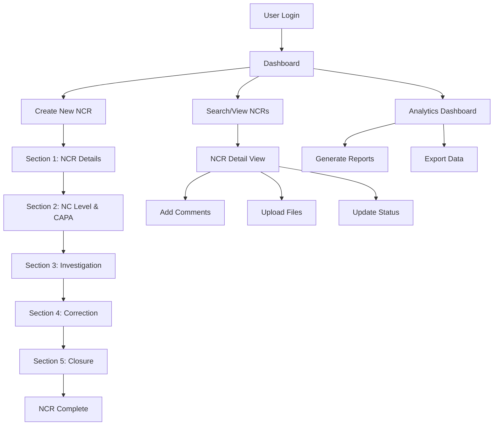

# NCTracker - System Architecture Design

## Overview
NCTracker is a Streamlit-based application designed to replace GitLab markdown-based NCR (Non-Conformance Report) management. The system provides a user-friendly interface, centralized database, analytics dashboard, and collaborative features.

## Technology Stack
- **Frontend**: Streamlit (Python)
- **Database**: SQLite
- **Data Analysis**: Pandas, NumPy
- **Visualizations**: Plotly
- **File Handling**: Built-in Python file operations
- **Authentication**: Simple session-based (can be enhanced)

## System Architecture

### Core Components

1. **User Management Module**
   - User authentication and session management
   - Role-based access control (NCR Owner, QE, MRB Team, etc.)
   - User profile management

2. **NCR Management Module**
   - Form-based NCR creation and editing
   - Status tracking and workflow management
   - Data validation and completeness checks

3. **Collaboration Module**
   - Comment system with @mentions
   - File attachment handling
   - Notification system

4. **Analytics Dashboard**
   - NCR metrics and KPIs
   - Trend analysis and visualizations
   - Custom reporting

5. **Search and Filter Module**
   - Advanced search capabilities
   - Filter by multiple criteria
   - Export functionality

### Application Flow




## Key Features

### 1. Form Wizard Interface
- Multi-step form with progress tracking
- Section-by-section completion with validation
- Auto-save functionality
- Required field highlighting

### 2. Workflow Management
- Status-based workflow (NEW → IN_PROGRESS → PENDING_APPROVAL → CLOSED)
- Automated approval routing based on NC level
- Email notifications for status changes
- Deadline tracking

### 3. Collaboration Features
- Real-time commenting system
- @mention functionality with notifications
- File attachment support
- Activity timeline

### 4. Analytics Dashboard
- NCR volume trends
- Category distribution
- Resolution time metrics
- Department performance
- Quality metrics

### 5. Search and Reporting
- Advanced search with filters
- Export to Excel/PDF
- Custom report generation
- Historical data analysis

## Security Considerations

1. **Authentication**: Session-based login with secure password handling
2. **Authorization**: Role-based access control
3. **Data Validation**: Input sanitization and validation
4. **File Security**: Secure file upload with type restrictions
5. **Audit Trail**: Comprehensive logging of all actions

## Deployment Architecture

```
┌─────────────────┐    ┌──────────────────┐    ┌─────────────────┐
│   Client PCs    │    │  NCTracker App   │    │   SQLite DB     │
│                 │    │                  │    │                 │
│ - Web Browser   │◄──►│ - Streamlit      │◄──►│ - NCR Data      │
│ - Local Network │    │ - File Storage   │    │ - User Data     │
│                 │    │ - Analytics      │    │ - Comments      │
└─────────────────┘    └──────────────────┘    └─────────────────┘
```

The application runs on a single server accessible to all users on the local network, providing a centralized, consistent experience for all NCR users.


## Database Schema Design

### Users Table
```sql
CREATE TABLE users (
    id INTEGER PRIMARY KEY AUTOINCREMENT,
    username VARCHAR(50) UNIQUE NOT NULL,
    email VARCHAR(100) UNIQUE NOT NULL,
    full_name VARCHAR(100) NOT NULL,
    role VARCHAR(20) NOT NULL, -- 'ncr_owner', 'qe', 'mrb_team', 'admin'
    department VARCHAR(50),
    created_at TIMESTAMP DEFAULT CURRENT_TIMESTAMP,
    last_login TIMESTAMP
);
```

### NCRs Table (Main Record)
```sql
CREATE TABLE ncrs (
    id INTEGER PRIMARY KEY AUTOINCREMENT,
    ncr_number VARCHAR(20) UNIQUE NOT NULL,
    title VARCHAR(200) NOT NULL,
    status VARCHAR(20) DEFAULT 'NEW', -- 'NEW', 'IN_PROGRESS', 'PENDING_APPROVAL', 'CLOSED'
    priority INTEGER DEFAULT 3, -- 1=Critical, 2=Adverse, 3=Moderate, 4=Low
    
    -- Section 1: NCR Details
    site VARCHAR(50),
    part_number VARCHAR(50),
    part_number_rev VARCHAR(20),
    quantity_affected INTEGER,
    units_affected TEXT,
    project_affected VARCHAR(100),
    serial_number VARCHAR(50),
    other_id VARCHAR(50),
    po_number VARCHAR(50),
    supplier VARCHAR(100),
    build_group_operation VARCHAR(100),
    
    -- Problem Statement
    problem_is TEXT,
    problem_should_be TEXT,
    
    -- Containment
    is_contained BOOLEAN,
    how_contained TEXT,
    containment_justification TEXT,
    
    -- Section 2: NC Level and CAPA
    nc_level INTEGER, -- 1,2,3,4
    capa_required BOOLEAN,
    capa_number VARCHAR(50),
    qe_assigned BOOLEAN,
    nc_owner_assigned BOOLEAN,
    external_notification_required BOOLEAN,
    external_notification_method TEXT,
    
    -- Section 3: Investigation
    problem_category VARCHAR(50), -- 'Document', 'Design', 'Manufacturing', etc.
    disposition_action VARCHAR(50), -- 'Rework', 'Repair', 'Reject', etc.
    disposition_instructions TEXT,
    disposition_justification TEXT,
    required_approvals TEXT, -- JSON array of required approvers
    
    -- Section 4: Correction
    correction_actions TEXT, -- JSON array of actions taken
    evidence_of_completion TEXT,
    
    -- Section 5: Closure
    closure_date DATE,
    qe_audit_complete BOOLEAN,
    
    -- Metadata
    created_by INTEGER NOT NULL,
    assigned_to INTEGER,
    created_at TIMESTAMP DEFAULT CURRENT_TIMESTAMP,
    updated_at TIMESTAMP DEFAULT CURRENT_TIMESTAMP,
    closed_at TIMESTAMP,
    
    FOREIGN KEY (created_by) REFERENCES users (id),
    FOREIGN KEY (assigned_to) REFERENCES users (id)
);
```

### Comments Table
```sql
CREATE TABLE comments (
    id INTEGER PRIMARY KEY AUTOINCREMENT,
    ncr_id INTEGER NOT NULL,
    user_id INTEGER NOT NULL,
    content TEXT NOT NULL,
    created_at TIMESTAMP DEFAULT CURRENT_TIMESTAMP,
    FOREIGN KEY (ncr_id) REFERENCES ncrs (id) ON DELETE CASCADE,
    FOREIGN KEY (user_id) REFERENCES users (id) ON DELETE CASCADE
);
```

### Attachments Table
```sql
CREATE TABLE attachments (
    id INTEGER PRIMARY KEY AUTOINCREMENT,
    ncr_id INTEGER NOT NULL,
    user_id INTEGER NOT NULL,
    filename VARCHAR(255) NOT NULL,
    file_path VARCHAR(500) NOT NULL,
    file_size INTEGER,
    mime_type VARCHAR(100),
    uploaded_at TIMESTAMP DEFAULT CURRENT_TIMESTAMP,
    FOREIGN KEY (ncr_id) REFERENCES ncrs (id) ON DELETE CASCADE,
    FOREIGN KEY (user_id) REFERENCES users (id) ON DELETE CASCADE
);
```

### Status History Table
```sql
CREATE TABLE status_history (
    id INTEGER PRIMARY KEY AUTOINCREMENT,
    ncr_id INTEGER NOT NULL,
    user_id INTEGER NOT NULL,
    old_status VARCHAR(20),
    new_status VARCHAR(20),
    change_reason TEXT,
    created_at TIMESTAMP DEFAULT CURRENT_TIMESTAMP,
    FOREIGN KEY (ncr_id) REFERENCES ncrs (id) ON DELETE CASCADE,
    FOREIGN KEY (user_id) REFERENCES users (id) ON DELETE CASCADE
);
```

### Mentions Table
```sql
CREATE TABLE mentions (
    id INTEGER PRIMARY KEY AUTOINCREMENT,
    comment_id INTEGER NOT NULL,
    mentioned_user_id INTEGER NOT NULL,
    notified BOOLEAN DEFAULT FALSE,
    created_at TIMESTAMP DEFAULT CURRENT_TIMESTAMP,
    FOREIGN KEY (comment_id) REFERENCES comments (id) ON DELETE CASCADE,
    FOREIGN KEY (mentioned_user_id) REFERENCES users (id) ON DELETE CASCADE
);
